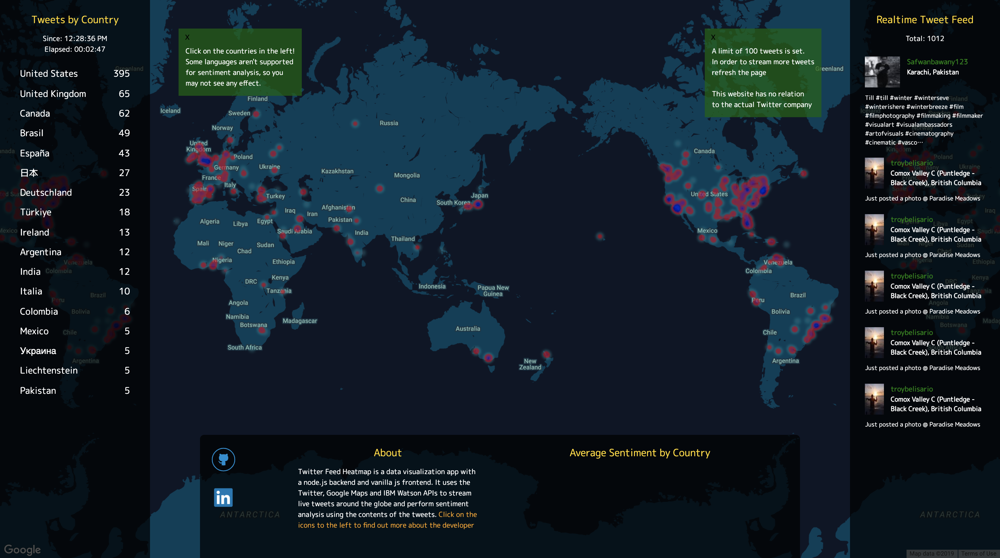
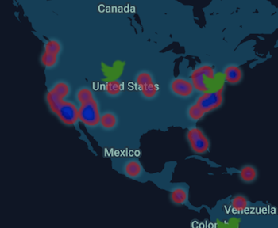

# Realtime Twitter Feed Heatmap

## Background and Overview
The Twitter Feed Heatmap is a data visualization application that displays tweeting activity in realtime based on geolocation. Tweets around the world will be shown as a datapoint on a map.

[REaltime Twitter Feed Heatmap](https://realtime-twitter-feed-heatmap.herokuapp.com/)



## Technologies
* Node.js (Backend logic, clientside logic)
* Websockets (Backend logic, clientside logic)
* Vanilla JS (frontend DOM manipulation)
* Twitter API (Data API requests)
* Google Maps API (Map visualization)

## Tweets by Country Statistics
The number of tweets by country since visiting the website is shown. The tweet count per country is also ranked using a fast sorting algorithm by manipulating the DOM nodes.
```
render() {
  const sortedCountries = this.sortNames();
  sortedCountries.forEach(country => {
    this.container.appendChild(this.indexItems[country].nodeElement);
  });
  this.leftNavElement.appendChild(this.container);
}
```


## Tweet Feed
The realtime tweets from people around the globe is shown along with the profile picture, username, location and tweet content. The tweet content in it's raw json value form contained information such as the original link. However, this was removed by using a regular expression.
```
const message = data.text.replace(/\shttps.*$/, '');
```


## Heatmap of tweeting activity
The realtime tweets received from the Twitter API were rendered as datapoints on the Google Maps API updating the map. Two different datapoints were used: (i) one showing the accumulation of all tweets and (ii) another one showing the current tweets (installed a expiration date to disappear after a certain time).
```
updateMarkers(data) {
  const marker = new window.google.maps.LatLng(...data.coordinates);
  this.markers.data.push(marker);
  let flash = new window.google.maps.Marker({
    position: {
      lat: data.coordinates[0],
      lng: data.coordinates[1]
    },
    map: this.map,
    icon: '../stylesheets/twitter1.png'
  });
  setTimeout(() => flash.setMap(null), 500);
}
```

